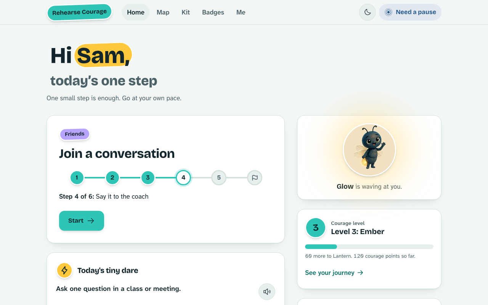
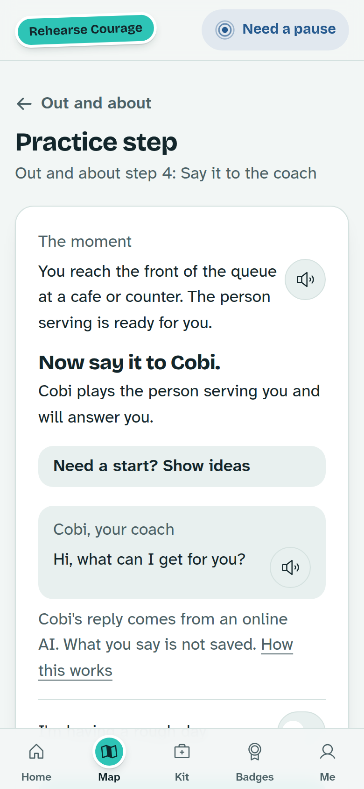
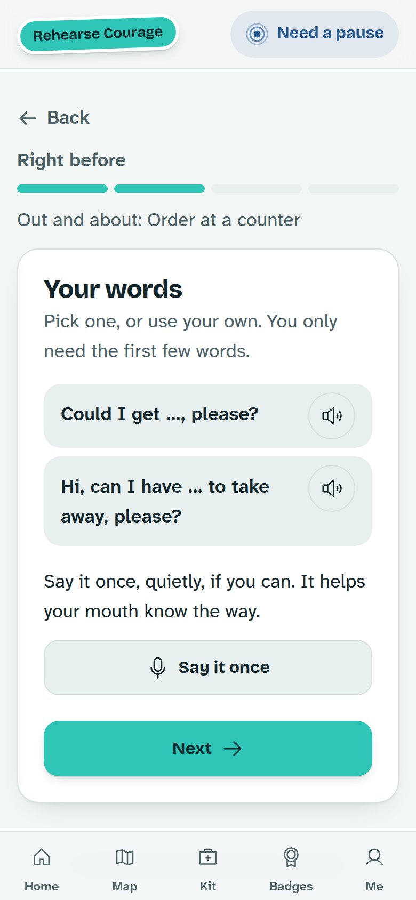
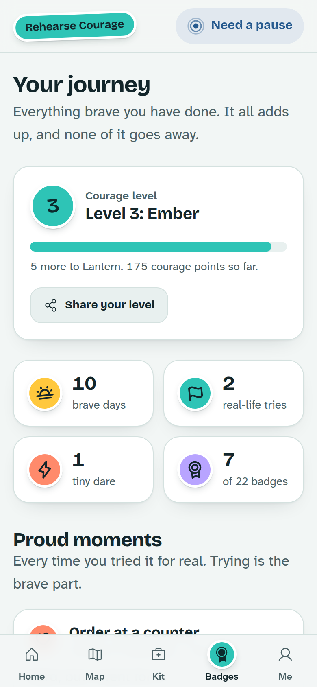
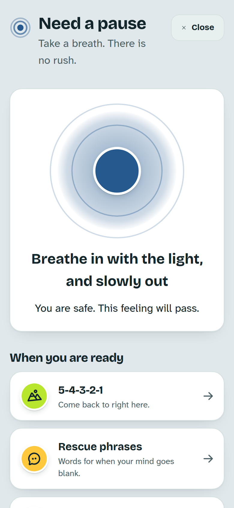
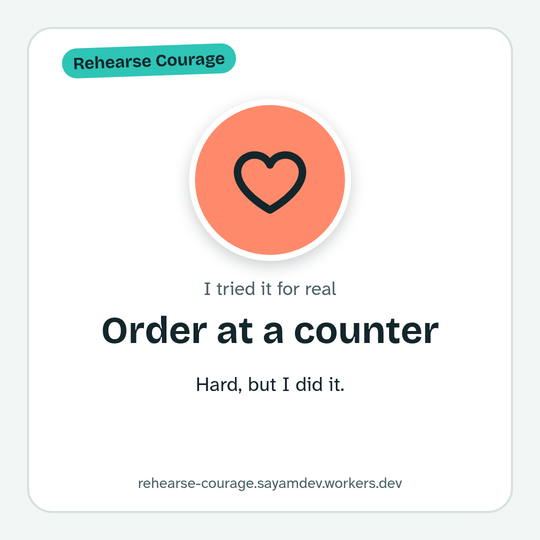

<div align="center">

# Rehearse Courage

**Speak up, one small step at a time.**

Free, private practice for anyone who finds it hard to speak up:
in class, with friends, in front of a group, or out and about.

A Rehearse project, by Sayam Ajmal.

**[▶ Open the app](https://rehearse-courage.sayamdev.workers.dev)** · [For parents and teachers](https://rehearse-courage.sayamdev.workers.dev/for-adults) · [Privacy](https://rehearse-courage.sayamdev.workers.dev/privacy)

<picture>
  <source media="(prefers-color-scheme: dark)" srcset="docs/screenshots/home-laptop-dark.png">
  
</picture>

</div>

---

## Who it is for

People of any age, children included, who find speaking up hard: because of
anxiety, panic, blushing, shyness, ADHD, a stutter, or losing their words. It
is practice, not therapy, and it never claims to treat anything.

## How it works

Every moment climbs the same **six small steps**. Go at your own pace, and go
back down any time.

| | Step | What you do |
|:-:|---|---|
| 1 | **Think it** | Read the moment and pick something you could say |
| 2 | **Type or whisper it** | Put it into words, just for you |
| 3 | **Say it out loud, alone** | Nobody is listening; the app only counts seconds |
| 4 | **Say it to the coach** | Cobi plays the teacher, a friend or the person serving you, and answers |
| 5 | **A little pressure** | The room turns to you and waits, kindly |
| 6 | **Try it for real** | Do it in real life, then say how it went. Trying counts just the same |

There are **18 moments on four islands**: Class, Friends, Presenting, and Out
and about (ordering food, asking in a shop, a phone call, asking the way). You
can add your own too.

<table>
<tr>
<td align="center" width="25%"><br><sub><b>Practise a step</b></sub></td>
<td align="center" width="25%"><br><sub><b>Right before the moment</b></sub></td>
<td align="center" width="25%"><br><sub><b>See how far you have come</b></sub></td>
<td align="center" width="25%"><br><sub><b>Need a pause, on every screen</b></sub></td>
</tr>
</table>

## What is inside

- **Need a pause** on every screen: a breathing circle, grounding and rescue phrases.
- **Body kit:** breathing, 5-4-3-2-1 grounding, blushing and sweating explained,
  rescue phrases, sentence frames and stutter-friendly speech tools.
- **Right before:** a one-minute warm-up for just before the real thing. One
  breath, your words, a rescue phrase, go.
- **Eight warm-up games:** Hot seat, Story dice, Rescue snap, Word builder,
  Breath balloon, Say it like, Describe it and Keep it going.
- **A companion** (a firefly you name) that grows braver as you do.
- **Progress that only goes up:** courage levels from Spark to Daybreak, brave
  days that add up and never reset, a tiny real-life dare each day, 22 badges,
  and small daily ideas.
- **Your journey:** every real-life try with how it felt, a lantern calendar of
  brave days, and a picture you can share, made on your device.
- **Voices** in British or American English for every line, with captions always on screen.
- **Cobi, the coach:** live replies for 13 and over; written in advance for under 13s.

<div align="center">

</div>

## Principles

1. **Courage, not performance.** It never scores fluency, fillers, pauses or
   stutters, not even as praise.
2. **Never punish.** No streaks to break, no losing, no leaderboards. "Not yet"
   counts too.
3. **One small step at a time,** and one thing on screen.
4. **Private by default.** No accounts, no ads, no trackers. Progress stays in
   the browser on your device, and a backup file is the only copy.
5. **Point back to real life.** The biggest wins happen outside the app.

## Safe for children

- Under 13 (or if the age question is skipped) never uses generative AI or
  sends words or voice anywhere.
- Anything typed is checked **on the device** for signs someone needs support,
  and the support lines for their country are shown instead.
- For 13 and over, only the words of one answer, the step and the age band are
  sent for a reply, and nothing is logged. Every reply passes a safety check.
- Built to **WCAG 2.2 AA** in light and dark, with 44px targets, full keyboard and
  screen reader support, a text-size setting and a reduce-motion setting.

---

## For developers

<details>
<summary><b>Run it locally</b></summary>

<br>

Needs Node 20 or newer.

```bash
npm install
npm run dev          # http://localhost:3330
```

| Command | What it does |
|---|---|
| `npm test` | Unit tests (Vitest) |
| `npm run test:e2e` | Browser journeys and accessibility checks (Playwright + axe) |
| `npm run typecheck` | TypeScript |
| `npm run lint` | ESLint |
| `npm run build` | Production build |
| `npm run cf:deploy` | Deploy to Cloudflare Workers (needs `npx wrangler login` once) |
| `npm run voices:record` | Record voice lines on the maker's Mac (see `docs/HANDOFF.md`) |

In a cloud container, run the browser tests with
`PW_CHROMIUM_PATH=/opt/pw-browsers/chromium npm run test:e2e`.

</details>

<details>
<summary><b>How it is built</b></summary>

<br>

- **Next.js 16** (App Router), **React 19**, **Tailwind CSS v4**, TypeScript.
- Hosted free on **Cloudflare Workers** via `@opennextjs/cloudflare`.
- **State** lives in `localStorage` only (`src/lib/state.ts`, `src/lib/store.ts`),
  kept in step across tabs.
- **AI** for 13 and over: Groq, then Workers AI, with Llama Guard on every reply;
  optional models that run on the device (WebLLM, and Whisper for under 13s' listening).
- **Voices:** Qwen3-TTS clips recorded ahead of time, with an on-device voice as a fallback.
- **Motion:** Lottie animations built in code, with real type turned into vector paths.

Where to find things:

| Path | What it holds |
|---|---|
| `src/components/views/` | One view per screen |
| `src/lib/` | Pure logic: steps, points, levels, badges, quests, dares |
| `src/lib/content/` | Situations, coach lines, phrases, dares, body kit |
| `src/lib/safety/` | The on-device crisis check and helplines |
| `src/lib/ai/` | Coach, tidy and speech-to-text, with the safety pipeline |
| `e2e/` | Playwright journeys, axe checks, no-sideways-scroll checks |

</details>

<details>
<summary><b>Documents</b></summary>

<br>

| File | What it holds |
|---|---|
| [`docs/HANDOFF.md`](docs/HANDOFF.md) | Start here: where things stand and what is next |
| [`PRODUCT.md`](PRODUCT.md) | Users, purpose, constraints and principles |
| [`DESIGN.md`](DESIGN.md) | The design system: colour, type, components and motion |
| [`docs/superpowers/specs/`](docs/superpowers/specs/) | The full product spec |
| [`design/art-manifest.md`](design/art-manifest.md) | Every piece of art and what is still to paint |

</details>

---

<div align="center">
<sub>Sister project to <a href="https://rehearse.sayamdev.workers.dev">Rehearse</a>, interview practice that talks back.<br>
© 2026 Sayam Ajmal. All rights reserved. See <a href="LICENSE">LICENSE</a>.</sub>
</div>
